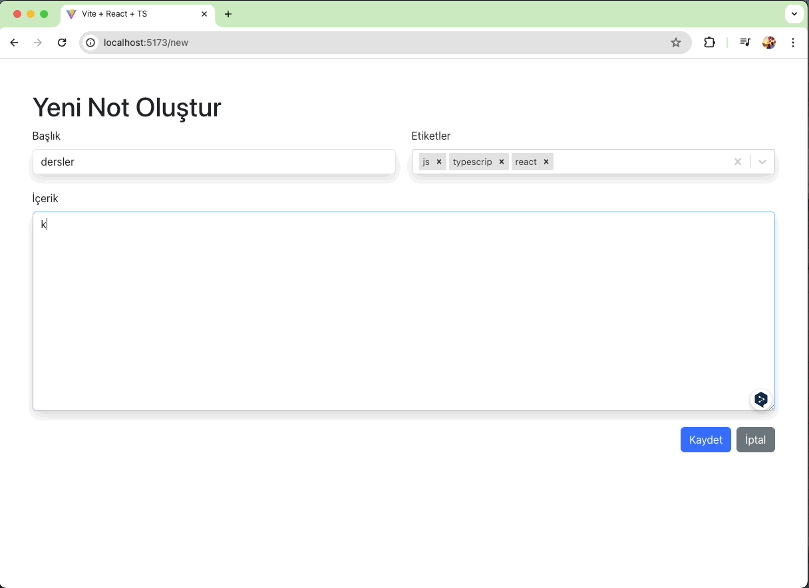

<h1>Not Alma Uygulaması</h1>

Bu proje, React ve TypeScript kullanılarak geliştirilmiş basit bir not alma uygulamasıdır. Notları oluşturabilir, düzenleyebilir, silebilir ve hatta etiketlere göre filtreleyebilirsiniz.

<h2>Özellikler</h2>

- Not oluşturma, düzenleme ve silme
- Etiketlere göre notları filtreleme
- Verilerin yerel depolanması
- Kullanıcı dostu arayüz

<h2>Kullanılan Teknolojiler ve Kütüphaneler</h2>

- React.js: Kullanıcı arayüzü geliştirmek için
- TypeScript: Tip güvenliği ve daha okunabilir kodlar için
- React Router: Sayfa yönlendirmesi ve rotalama için
- Bootstrap: Görsel olarak çekici ve duyarlı bir tasarım için
- react-bootstrap: Bootstrap bileşenlerinin React uyumlu sürümü
- uuid: Benzersiz kimlik oluşturmak için
- react-markdown: Markdown içeriğini render etmek için
- react-select: Gelişmiş seçenekli dropdownlar için

<h2>Ekran Görüntüsü</h2>

